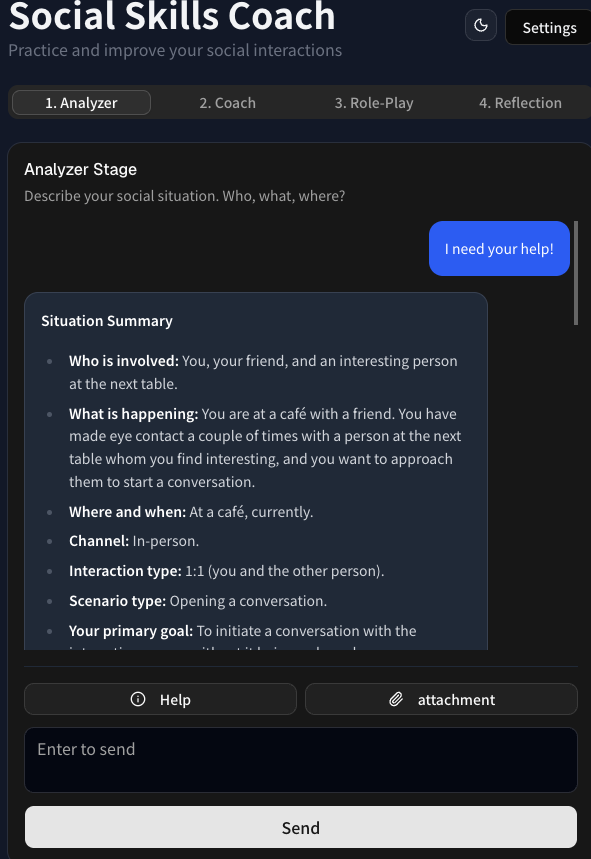

# 社交技巧 AI 教練（Social Skills AI Coach）

**用多代理（multi-agent）AI 教練練習真實社交情境 —— 分析、建議、角色扮演、復盤 —— 隨時可用,成本僅 2~6 美金 / 月。**

[](https://social-skill-ai-coach.vercel.app)
[](https://www.npmjs.com/package/social-skills-coach-mcp)
[](https://github.com/john-data-chen/social-skill-ai-coach/actions/workflows/ci.yml)
[](https://codecov.io/gh/john-data-chen/social-skill-ai-coach)
[](https://sonarcloud.io/summary/new_code?id=john-data-chen_social-skill-ai-coach)
[](https://opensource.org/licenses/MIT)

🔗 **[線上 Demo](https://social-skill-ai-coach.vercel.app)** · 🎬 **影片導覽(製作中)** · 📦 **[npm: `social-skills-coach-mcp`](https://www.npmjs.com/package/social-skills-coach-mcp)** · 🇬🇧 **[English](./README.md)**

> ⚠️ 為 [Kaggle AI Agents Capstone](https://www.kaggle.com/competitions/vibecoding-agents-capstone-project)（組別 **Agents for Good**）開發的概念性 MVP,僅供評審與研究。**無法取代具執照的心理師或治療師。** 完整免責聲明見文末。

<p align="center">
  
</p>

---

社交技巧是可以學的,但很難「練習」:真實對話風險高、機會一次性,而且幾乎沒有人會當場給你誠實回饋。**社交技巧 AI 教練**把 PEERS 風格的課程,變成一位你能隨時演練的教練,透過四階段循環:

**分析 → 建議 → 角色扮演 → 復盤** —— 每個階段一個專職 AI 代理,以真實課程為依據。

## 🧩 要解決的問題

對高功能自閉或亞斯伯格（Asperger）的人來說,社交技巧主要靠**實際演練**學會 —— 但有結構的練習既稀少又昂貴:

- **費用高昂。** 像 [PEERS](https://www.semel.ucla.edu/peers/) 完整 14–16 週課程要 **2,800–3,600 美元**,而且課程是累積式的——缺一堂,後面全受影響。很多家庭負擔不起,或因自尊而不願承認。
- **當下沒有回饋。** 即使上完課,真實對話裡也沒有教練站你旁邊。別人很少告訴你哪裡做錯,只會慢慢疏遠你。而一個突如其來的干擾（噪音、意外）就可能讓你腦中一片空白,任何技巧都想不起來。
- **太晚開始的代價。** 社交習慣一旦固定,排擠與霸凌往往延續到成年——而極少有成年人願意回去跟年紀小很多的學生一起上社交課。

本專案把開始練習的門檻降到最低:一個私密、不被評斷、隨時可用的練習空間。

## 🤖 為什麼用代理（agents）?

單一聊天機器人會把四件性質完全不同的工作混在一起。教練本質上是一條**專家流水線**,所以本應用每個工作各用一個代理,並由確定性（deterministic）階段路由器推進流水線,再由 LLM orchestrator 為 Coach 做課程落地（RAG）:

| 階段 | 代理                      | 工作                                                                    |
| :--- | :------------------------ | :---------------------------------------------------------------------- |
| 1    | **Analyzer（分析）**      | 結構化整理情境（誰／什麼／何地、管道、情境類型、目標）,此階段不給建議。 |
| 2    | **Coach（教練）**         | 給出具體、貼合情境的建議——只依據為此情境挑選出的課程片段。              |
| 3    | **Role-Play（角色扮演）** | 扮演對方讓你練習,並依你的社交表現給出真實反應。                         |
| 4    | **Reflection（復盤）**    | 依評分準則檢視角色扮演逐字稿,回傳結構化、逐面向的評估。                 |

**Orchestrator（協調器）** 執行檢索增強式的知識落地（RAG）:在 Coach 階段,先由 LLM 挑出與使用者情境最相關的課程主題,再只載入那些知識片段——讓建議嚴格綁定課程,而非幻覺。

**用 slash 指令操作。** 對話中隨時跳到任一階段 —— `/analyzer`、`/coach`、`/role-play`、`/reflection`:

<p align="center">
  
</p>

---

## 🏗️ 架構


**核心概念:** 課程只撰寫一次、做成 **Agent Skill**,並以兩種方式被消費——對內由教練代理直接 in-process 使用（求速度）,對外則透過 **Model Context Protocol（MCP）** 開放給任何 MCP client（求重用與互通）。唯一真實來源,不會漂移。

### 對應到課程概念

| 概念                  | 位置        | 如何呈現                                                                                                     |
| :-------------------- | :---------- | :----------------------------------------------------------------------------------------------------------- |
| **Agent／多代理系統** | Code        | 四個專職代理組成階段式流水線,以確定性階段路由推進,另由 LLM orchestrator 做知識路由（RAG）為 Coach 落地。     |
| **MCP Server**        | Code        | `/api/mcp` 以 MCP 形式對外開放 `list_social_topics` + `get_social_knowledge`（tools）與四個代理（prompts）。 |
| **Agent Skills**      | Code        | `skills/social-skills-coach/` 把課程封裝成可載入的 Skill——所有知識的唯一來源。                               |
| **安全性**            | Code        | BYOK（你的 API key 留在瀏覽器 session、不在 server 端儲存）+ 於 API 信任邊界用 zod 驗證每一個請求。          |
| **可部署性**          | Docs／Video | 已部署於 Vercel;重現步驟見下文。                                                                             |
| **Antigravity**       | Video       | 以 Antigravity IDE + CLI 開發,於投稿影片中展示。                                                             |

---

## ✨ 功能

- **四階段教練循環**——Analyzer → Coach → Role-Play → Reflection。
- **課程落地的建議**——Coach 只依據為**你的**情境檢索出的課程片段（RAG）回答,而非通用建議。
- **Agent Skill 課程**——社交知識撰寫成可重用的 Skill,唯一真實來源。
- **MCP 伺服器（自帶你的模型）**——四個 agent 以 MCP prompts + 知識 tools 形式開放,任何 MCP client 都能用自己的模型跑整套教練。發佈為 npm stdio 套件 [`social-skills-coach-mcp`](https://www.npmjs.com/package/social-skills-coach-mcp)。
- **多模型**——可在 Xiaomi MiMo 與 DeepSeek 間切換;demo key 失效時自動切換備援。
- **附件**——上傳圖片與文字檔（`.md`、`.txt`、`.csv`）供 AI 分析。
- **針對手機操作優化**——讓你在當下就能掏出來用:只要能聯網打開 Demo 網頁,教練隨時隨地在你口袋裡。
- **深色／淺色主題**——減少眼睛疲勞,對光敏感的人尤其重要。

---

## 🔒 安全性

安全性在每一個信任邊界都有落實——瀏覽器、API、以及 MCP 伺服器:

- **BYOK,永不留存。** API key 以每次請求的 `Authorization: Bearer` header 傳送,僅在記憶體中使用;不寫入 log、也不寫入資料庫。
- **僅限 session 的儲存。** 瀏覽器把 key 與聊天紀錄存在 `sessionStorage`（而非 `localStorage`）,關閉分頁即自動清除。
- **信任邊界以 zod 驗證。** 每個 `/api/chat` 與 MCP 請求都用 zod 解析;格式錯誤的 JSON 或結構在進入任何模型前就被擋下（`400`）,缺少金鑰則直接 gating（`401`）。
- **不洩漏內部資訊。** 錯誤只在 server 端記錄;client 只拿到通用訊息（`Internal Server Error`）,絕不回傳 stack trace 或機密。
- **無狀態設計。** 沒有資料庫、沒有 server 端使用者資料。

---

## 🧰 當成 MCP 伺服器用（自帶你的模型）

整套教練能力**同時也是一個獨立 MCP 伺服器**,任何人都能用**自己的模型**跑它。四個 agent 以 MCP **prompts** 形式開放——它們在**連線方 client 的模型**上執行——所以伺服器本身不需要任何 API key、也不跑任何推論。這就是別人能換上比 demo（便宜的）MiMo/DeepSeek 更強模型的方式。

- **Prompts**（在你的模型上跑）:`analyze_situation` · `coach` · `roleplay` · `reflect`
- **Tools**（知識 grounding）:`list_social_topics` · `get_social_knowledge({ topics })`

### 方式一 — npm 套件（stdio,本機 client 推薦）

發佈為 [`social-skills-coach-mcp`](https://www.npmjs.com/package/social-skills-coach-mcp)。加進你的 client `mcp.json`（Claude Desktop、Cursor、Antigravity……）:

```json
{
  "mcpServers": {
    "social-skills-coach": { "command": "npx", "args": ["-y", "social-skills-coach-mcp"] }
  }
}
```

或用 MCP Inspector 互動檢視:

```bash
npx @modelcontextprotocol/inspector npx -y social-skills-coach-mcp
```

### 方式二 — hosted HTTP（已部署的 app）

同一套能力也在 `POST <你的網址>/api/mcp`（Streamable HTTP）提供。快速煙霧測試:

```bash
curl -s -X POST http://localhost:3000/api/mcp \
  -H "Content-Type: application/json" \
  -H "Accept: application/json, text/event-stream" \
  -d '{"jsonrpc":"2.0","id":1,"method":"tools/call","params":{"name":"get_social_knowledge","arguments":{"topics":["opening"]}}}'
```

兩種形式共用同一個 core（`registerSocialSkillsMcp`）與同一份課程來源（Agent Skill）,不會漂移。

---

## 📂 專案結構

```text
├── skills/social-skills-coach/  # Agent Skill：課程（產品環境運作的知識,唯一真實來源）
├── .agents/skills/              # Antigravity agent skills（開發期 AI 輔助技能,如 karpathy/vercel）
├── packages/
│   └── social-skills-coach-mcp/ # 可發佈的 npm stdio MCP 伺服器（prompts + tools）
├── .github/workflows/           # CI/CD（測試與 Vercel 部署）
├── __tests__/
│   ├── e2e/                      # Playwright 端對端測試
│   └── units/                    # Vitest 單元測試
├── src/
│   ├── app/
│   │   ├── api/
│   │   │   ├── chat/route.ts         # 教練聊天：路由 + RAG 落地 + 串流
│   │   │   └── [transport]/route.ts  # MCP 伺服器（解析為 /api/mcp）
│   │   ├── layout.tsx
│   │   └── page.tsx                  # 主要 UI 與聊天介面
│   ├── components/                   # React 元件（ui/ 來自 Base UI / shadcn）
│   └── lib/
│       ├── agents/                   # 階段代理 + 知識 adapter
│       ├── knowledge/                # 讀取 Agent Skill 片段的 loader
│       ├── mcp/server-setup.ts       # 共用 MCP 註冊（tools + agent prompts）
│       ├── orchestrator.ts           # LLM 主題挑選 + 落地（server-only）
│       ├── router.ts                 # Deterministic 階段路由（client 安全）
│       ├── ai.ts                     # 供應商初始化（MiMo / DeepSeek）
│       └── store.ts                  # Zustand 狀態（歷史、設定）
├── public/
│   └── images/                  # 架構 PNG、封面、截圖（README／媒體素材）
├── next.config.mjs              # outputFileTracingIncludes 把 skill md 打包進 Vercel
└── env.example                  # 環境變數範本
```

---

## 💻 本機開發與測試

### 1. 環境需求

- [Node.js](https://nodejs.org/)（v24 或最新 LTS）
- [pnpm](https://pnpm.io/installation)（最新版）

### 2. 安裝

```bash
pnpm install
```

### 3. 環境變數（可選——僅 Demo 模式需要）

本應用預設使用 **BYOK**:你可以在設定對話框貼上自己的 API key,無需任何 server 設定。若要改用內建的「Demo（Server Key）」模式:

```bash
cp env.example .env
# 接著填入 MIMO_API_KEY + MIMO_API_BASE_URL ／ DEEPSEEK_API_KEY
```

### 4. 執行

```bash
pnpm dev          # 啟動開發伺服器於 http://localhost:3000
pnpm test         # 單元測試（Vitest）
pnpm test:e2e     # 端對端測試（Playwright）
pnpm build        # 正式建置（typecheck + Next build）
```

---

## 🚀 部署（Vercel）

本應用已部署於 Vercel,且無需特別設定:

1. 把 GitHub repo 匯入 Vercel。
2. （可選）在專案的 Environment Variables 設定 `MIMO_API_KEY` / `DEEPSEEK_API_KEY` 以在正式環境啟用 Demo 模式。BYOK 不需任何 server 金鑰即可運作。
3. 部署。`next.config.mjs` 裡的 `outputFileTracingIncludes` 會把 Agent Skill 的 markdown 打包進 serverless functions,因此 `/api/chat` 與 `/api/mcp` 都能在 runtime 讀到課程。

> **切勿提交 API key 或密碼。** 請使用環境變數。

---

## 🛠️ 技術棧

Next.js（App Router）· React · TypeScript（strict）· TailwindCSS · Vercel AI SDK · Zustand · Vitest + Playwright · pnpm · 部署於 Vercel。

---

## 📋 未來發展

- 支援更多 AI 供應商:Anthropic、OpenAI、Google Gemini。

---

## ⚠️ 免責聲明

此專案是為了 [Kaggle AI Agents: Intensive Vibe Coding Capstone Project](https://www.kaggle.com/competitions/vibecoding-agents-capstone-project) 所開發的概念性產品（最小可行性產品）,參加組別為 **Agents for Good**,僅供評審與有興趣者研究。專案所有功能（包含但不限於 Demo、AI agent、Skill、MCP）皆**無法取代受過專業訓練且擁有合格證照的心理師或助人工作者**,且**無法提供任何醫療與諮商行為**。

示範網站目前使用 [Xiaomi MiMo token plan](https://platform.xiaomimimo.com/token-plan) 運作（用最低成本實現最小可行性產品）,可以直接使用,**在 Kaggle 審核過後月費就會失效**。您可以自行訂閱 MiMo token Plan (最低 6 美金 / 月 ) 或去 [DeepSeek](https://platform.deepseek.com/) 充值取得您自己的 Key（BYOK）,最低僅需 2 美金。

請始終記住:**您是在跟 AI 對話。** 應避免在對話中提及真實姓名、電話、地址等個人資訊,必要時用化名。AI 可能會出錯與幻覺——所有建議僅供參考。

---

## 📄 授權

[MIT](https://opensource.org/licenses/MIT)
