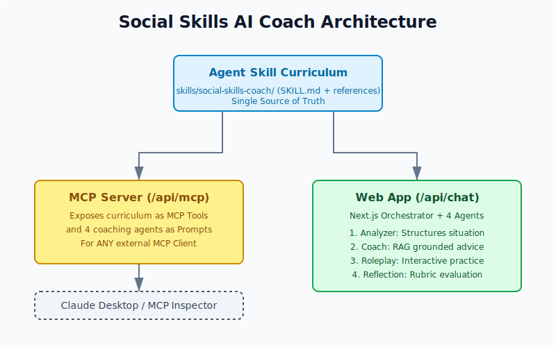

# Social Skills AI Coach

[](https://codecov.io/gh/john-data-chen/social-skill-ai-coach)
[](https://sonarcloud.io/summary/new_code?id=john-data-chen_social-skill-ai-coach)
[](https://github.com/john-data-chen/social-skill-ai-coach/actions/workflows/ci.yml)
[](https://opensource.org/licenses/MIT)

> 繁體中文版說明請見 [README-cht.md](./README-cht.md)。

A multi-agent web app that helps people **practice and improve real social interactions** in a safe space. You describe a situation, get concrete advice grounded in a structured social-skills curriculum, rehearse it in a role-play, and receive a structured reflection — a full coaching loop, on demand.

> **Live demo:** deployed on Vercel — [https://social-skill-ai-coach.vercel.app](https://social-skill-ai-coach.vercel.app).

> ⚠️ **Disclaimer:** This project is a conceptual product (minimum viable product) developed for [Kaggle AI Agents: Intensive Vibe Coding Capstone Project](https://www.kaggle.com/competitions/vibecoding-agents-capstone-project). The participating group is **Agents for Good** and is only for review and research by interested parties. All functions of the project (including but not limited to Demo, AI agent, Skill, MCP) cannot replace professionally trained and licensed psychologists or helping workers, and cannot provide any medical treatment or consultation.

> The demonstration website is currently operated by Xiaomi Mimo monthly subscription (implementing a minimum viable product at the lowest cost) and can be used directly. **The monthly subscription will be invalid after Kaggle review**. You can go to [Deep Seek](https://platform.deepseek.com/) to recharge to get your own Key (BYOK), which minimum cost is $2.

> Please always remember: You are talking to AI, so you should avoid mentioning personal information such as your real name, phone number, address, etc. in the conversation. If necessary, use a pseudonym or other methods to avoid revealing your true identity. In addition, since AI may make errors and hallucinations, all suggestions are for reference only.

---

## 🧩 The problem

Social skills are learnable, but they are hard to _practice_: real conversations are high-stakes, one-shot, and rarely come with honest feedback. People who most want to improve have the fewest low-risk reps. This project turns an 8-lesson social-skills curriculum into an on-demand coach you can rehearse with as many times as you like.

## 💡 Why this matters

For people with high-functioning autism or Asperger's, social skills are learned mainly through **practice** — yet structured practice is scarce and expensive:

- **Cost.** Evidence-based programs like [PEERS](https://www.semel.ucla.edu/peers/) fees range between $2,800 to $3,600 for a full 14–16 week course, and the curriculum is cumulative — miss one session and the rest suffers. Many families, can't afford a full course or parents may be unwilling to acknowledge their child's need to attend classes due to pride or other factors.
- **No feedback in the moment.** Even after completing the course, in real-world social situations, there will never be a coach standing beside you, telling you what you did right and wrong. You also can't tell others beforehand that you have neurotic diversity; (especially in Asia) most people probably don't know what that means and will simply see you as a weirdo. How others will react when you make a mistake is unpredictable. They won't tell you what you did wrong; they'll just gradually distance themselves from you, or even ridicule you. Furthermore, a sudden interruption in a social situation (like noise) can cause your mind to go blank, making it impossible to recall any of the techniques from the course.
- **The cost of starting late.** Once social habits set in, exclusion and bullying often follow into adulthood — and very few adults are willing to admit they lack social skills and go back to take social classes with other students who are much younger.

This project uses a PEERS-style curriculum as the blueprint for a coach you can practice with anytime, through an **Analyze → Coach → Role-Play → Reflect** loop — lowering the barrier to _starting_ as far as possible.

## 🤖 Why agents?

A single chatbot would blur four very different jobs. Coaching is naturally a **pipeline of specialists**, so the app uses one agent per job:

| Stage | Agent          | Job                                                                                                        |
| :---- | :------------- | :--------------------------------------------------------------------------------------------------------- |
| 1     | **Analyzer**   | Structures the situation (who/what/where, channel, scenario type, goal) without giving advice yet.         |
| 2     | **Coach**      | Gives concrete, situation-specific advice — grounded only in the curriculum slices selected for this case. |
| 3     | **Role-Play**  | Plays the other person so you can practice, reacting realistically to your social-skill level.             |
| 4     | **Reflection** | Reviews the role-play transcript against the rubric and returns a structured, per-dimension evaluation.    |

The agents are coordinated by an **orchestrator** that performs retrieval-augmented grounding: for the Coach stage it LLM-selects the curriculum topics most relevant to the user's situation, then loads just those knowledge slices.

---

## 🏗️ Architecture



**Key idea:** the curriculum is authored once as an **Agent Skill** and consumed two ways — internally by the coaching agents (in-process, for speed) and externally by any MCP client over the **Model Context Protocol** (for reuse and interoperability).

### Course concepts demonstrated

| Concept                        | Where        | How it is demonstrated                                                                                                                  |
| :----------------------------- | :----------- | :-------------------------------------------------------------------------------------------------------------------------------------- |
| **Agent / Multi-agent system** | Code         | Four specialized agents in a staged pipeline, coordinated by an orchestrator with LLM-driven knowledge routing.                         |
| **MCP Server**                 | Code         | `/api/mcp` exposes `list_social_topics` + `get_social_knowledge` over MCP for any external client.                                      |
| **Agent Skills**               | Code         | `skills/social-skills-coach/` packages the curriculum as a loadable Skill — the single source of truth for all knowledge.               |
| **Security features**          | Code         | BYOK (your API key stays in the browser session, never stored server-side) + zod validation of every request at the API trust boundary. |
| **Deployability**              | Docs / Video | Deployed on Vercel; reproduce steps below.                                                                                              |
| **Antigravity**                | Video        | Shown in the submission video.                                                                                                          |

---

## ✨ Features

- **4-stage coaching loop** — Analyzer → Coach → Role-Play → Reflection.
- **Agent Skill curriculum** — social-skills knowledge authored as a reusable Skill.
- **MCP server (bring your own model)** — the four agents are exposed as MCP prompts + knowledge tools, so any MCP client can run the whole coach with its own model. Distributable as an npm stdio package (`social-skills-coach-mcp`).
- **Retrieval-augmented coaching** — the Coach is grounded only in the slices relevant to your situation.
- **BYOK (Bring Your Own Key)** — use your own API key directly from the browser session.
- **Multi-model** — switch between Xiaomi MiMo and DeepSeek (OpenAI-compatible).
- **Attachments** — upload images and text files (`.md`, `.txt`, `.csv`) for the AI to analyze.
- **Dark / Light theme.**

---

## 🧰 Use it as an MCP server (bring your own model)

The whole coaching capability is **also a standalone MCP server**, so anyone can run
it with their OWN model. The four agents are exposed as MCP **prompts** — they execute
on the _connecting client's_ model — so the server needs no API key and runs no
inference itself. That is how others can plug in a more capable model than the demo's
(cheap) MiMo/DeepSeek.

- **Prompts** (run on your model): `analyze_situation` · `coach` · `role-play` · `reflect`
- **Tools** (knowledge grounding): `list_social_topics` · `get_social_knowledge({ topics })`

### Option 1 — npm package over stdio (recommended for local clients)

Published as [`social-skills-coach-mcp`](./packages/social-skills-coach-mcp). Add it to
Claude Desktop's `claude_desktop_config.json`:

```json
{
  "mcpServers": {
    "social-skills-coach": { "command": "npx", "args": ["-y", "social-skills-coach-mcp"] }
  }
}
```

Or inspect it interactively:

```bash
npx @modelcontextprotocol/inspector npx -y social-skills-coach-mcp
```

### Option 2 — hosted HTTP (the deployed app)

The same capability is served at `POST <your-host>/api/mcp` (Streamable HTTP transport).
Quick smoke test against a running server:

```bash
curl -s -X POST http://localhost:3000/api/mcp \
  -H "Content-Type: application/json" \
  -H "Accept: application/json, text/event-stream" \
  -d '{"jsonrpc":"2.0","id":1,"method":"tools/call","params":{"name":"get_social_knowledge","arguments":{"topics":["opening"]}}}'
```

Both forms share one core (`registerSocialSkillsMcp`) and one curriculum source (the
Agent Skill), so they never drift.

---

## 📂 Repository structure

```text
├── skills/social-skills-coach/  # Agent Skill: the curriculum (runtime product knowledge, single source of truth)
├── .agents/skills/              # Antigravity agent skills (development-time AI assistants like karpathy/vercel)
├── packages/
│   └── social-skills-coach-mcp/ # Publishable npm stdio MCP server (prompts + tools)
├── .github/workflows/           # CI/CD (testing & Vercel deployment)
├── __tests__/
│   ├── e2e/                      # Playwright end-to-end tests
│   └── units/                    # Vitest unit tests
├── src/
│   ├── app/
│   │   ├── api/
│   │   │   ├── chat/route.ts         # Coaching chat: routing + RAG grounding + streaming
│   │   │   └── [transport]/route.ts  # MCP server (resolves to /api/mcp)
│   │   ├── layout.tsx
│   │   └── page.tsx                  # Main UI and chat interface
│   ├── components/                   # React components (ui/ from Base UI / shadcn)
│   └── lib/
│       ├── agents/                   # Stage agents + knowledge adapter
│       ├── knowledge/                # Loader that reads the Agent Skill slices
│       ├── mcp/server-setup.ts       # Shared MCP registration (tools + agent prompts)
│       ├── orchestrator.ts           # LLM topic selection + grounding (server-only)
│       ├── router.ts                 # Deterministic stage routing (client-safe)
│       ├── ai.ts                     # Provider init (MiMo / DeepSeek)
│       └── store.ts                  # Zustand state (history, config)
├── public/
│   └── architecture.svg         # System architecture diagram
├── ai-docs/
│   └── task-template.md         # A task template for AI agent to assist in vibe coding
├── next.config.mjs              # outputFileTracingIncludes ships the skill md to Vercel
├── playwright.config.ts
├── vitest.config.ts
├── package.json
└── env.example                  # Template for environment variables
```

---

## 💻 Local development & testing

### 1. Prerequisites

- [Node.js](https://nodejs.org/) (v24 or latest LTS)
- [pnpm](https://pnpm.io/installation) (latest)

### 2. Install

```bash
pnpm install
```

### 3. Environment variables (optional — only for "Demo" mode)

The app defaults to **BYOK**: you can paste your own API key in the Settings dialog, no server config needed. To use the built-in "Demo (Server Key)" mode instead:

```bash
cp env.example .env
# then fill in MIMO_API_KEY and/or DEEPSEEK_API_KEY
```

### 4. Run

```bash
pnpm dev          # start the dev server at http://localhost:3000
pnpm test         # unit tests (Vitest)
pnpm test:e2e     # end-to-end tests (Playwright)
pnpm build        # production build (typecheck + Next build)
```

---

## 🚀 Deployment (Vercel)

The app is deployed on Vercel and needs no special configuration:

1. Import the GitHub repo into Vercel.
2. (Optional) set `MIMO_API_KEY` / `DEEPSEEK_API_KEY` in the project's Environment Variables to enable Demo mode in production. BYOK works without any server keys.
3. Deploy. The `outputFileTracingIncludes` setting in `next.config.mjs` ensures the Agent Skill markdown is bundled into the serverless functions, so both `/api/chat` and `/api/mcp` can read the curriculum at runtime.

> **Never commit API keys or passwords.** Use environment variables.

---

## 📋 Future development

- Support more AI providers such as Anthropic, OpenAI, Google Gemini, etc.

---

## 📄 License

[MIT](https://opensource.org/licenses/MIT)
