# Social Skills AI Coach

**Practice real social situations with a multi-agent AI coach — analyze, get advice, role-play, and reflect — anytime, for the cost only 2~6 USD/month.**

[](https://social-skill-ai-coach.vercel.app)
[](https://www.npmjs.com/package/social-skills-coach-mcp)
[](https://github.com/john-data-chen/social-skill-ai-coach/actions/workflows/ci.yml)
[](https://codecov.io/gh/john-data-chen/social-skill-ai-coach)
[](https://sonarcloud.io/summary/new_code?id=john-data-chen_social-skill-ai-coach)
[](https://opensource.org/licenses/MIT)

🔗 **[Live Demo](https://social-skill-ai-coach.vercel.app)** · 🎬 **[Demo](#demo)** · 📦 **[npm: `social-skills-coach-mcp`](https://www.npmjs.com/package/social-skills-coach-mcp)** · 🇹🇼 **[繁體中文](./README-cht.md)**

> ⚠️ Conceptual MVP for the [Kaggle AI Agents Capstone](https://www.kaggle.com/competitions/vibecoding-agents-capstone-project) (track: **Agents for Good**), for review and research only. **It cannot replace a licensed psychologist or therapist.** Full disclaimer at the bottom.

<p align="center">
  <a id="demo"></a>
  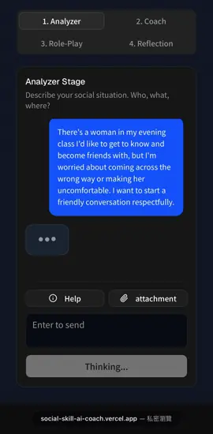
  <br /><sub>The four-stage loop on a real phone — Analyze → Coach → Role-Play → Reflect.</sub>
</p>

---

Social skills can be learned — but they're hard to _practice_. Real conversations are high-risk, the chances are one-off, and almost no one gives you honest feedback in the moment. **Social Skills AI Coach** turns a PEERS-style curriculum into a coach you can rehearse with anytime, through a four-stage loop:

**Analyze → Coach → Role-Play → Reflect** — one specialized AI agent per stage, grounded in a real curriculum.

## 🧩 The problem

For people with high-functioning autism or Asperger's, social skills are learned mainly through **practice** — yet structured practice is scarce and expensive:

- **Cost.** Evidence-based programs like [PEERS](https://www.semel.ucla.edu/peers/) run **$2,800–$3,600** for a 14–16 week course, and the curriculum is cumulative — miss one session and the rest suffers. Many families can't afford it, or won't, out of pride.
- **No feedback in the moment.** Even after the course, no coach stands beside you in a real conversation. People rarely tell you what you did wrong — they just quietly distance themselves. And a sudden interruption (noise, surprise) can blank your mind so you can't recall any technique.
- **The cost of starting late.** Once social habits set, exclusion follows into adulthood — and few adults will sit in a class of much younger students to relearn the basics.

This project lowers the barrier to _starting_ as far as possible: a private, judgment-free place to practice, on demand.

## 🤖 Why agents?

A single chatbot would blur four very different jobs. Coaching is naturally a **pipeline of specialists**, so the app runs one agent per job — advanced through the pipeline by a deterministic stage router, with an LLM orchestrator grounding the Coach in curriculum (RAG):

| Stage | Agent          | Job                                                                                                        |
| :---- | :------------- | :--------------------------------------------------------------------------------------------------------- |
| 1     | **Analyzer**   | Structures the situation (who/what/where, channel, scenario type, goal) — without giving advice yet.       |
| 2     | **Coach**      | Gives concrete, situation-specific advice — grounded only in the curriculum slices selected for this case. |
| 3     | **Role-Play**  | Plays the other person so you can practice, reacting realistically to your social-skill level.             |
| 4     | **Reflection** | Reviews the role-play transcript against a rubric and returns a structured, per-dimension evaluation.      |

<p align="center">
  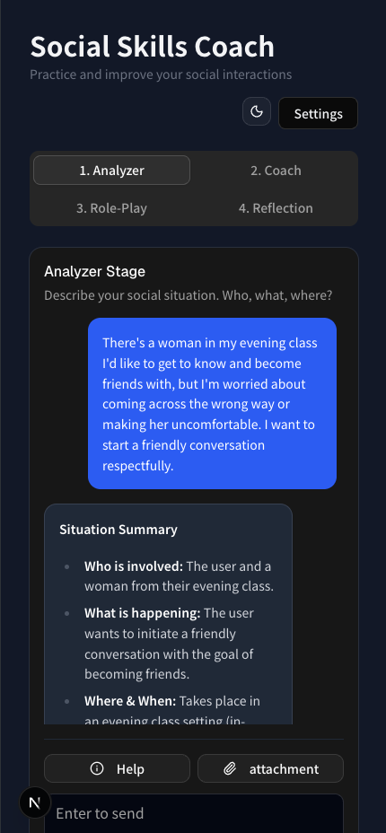
  <br />
  <em>Stage 1 — the Analyzer turns a vague, anxious situation into a clear structure.</em>
</p>

The **orchestrator** performs retrieval-augmented grounding: for the Coach stage it LLM-selects the curriculum topics most relevant to your situation, then loads just those knowledge slices — so advice stays strictly curriculum-bound instead of hallucinated.

**Drive it with slash commands.** Jump to any stage mid-conversation — `/analyzer`, `/coach`, `/role-play`, `/reflection`:

<p align="center">
  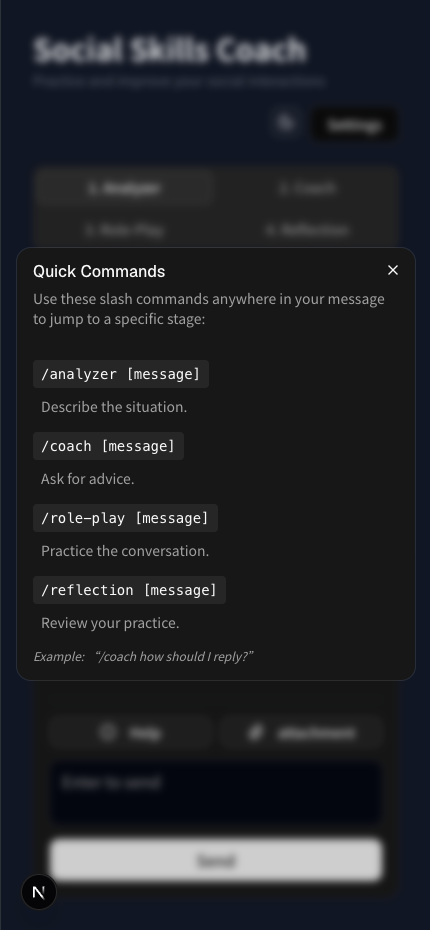
</p>

---

## 🎬 A full session

Continuing the same example — respectfully befriending a classmate — from the Analyzer above through **Coach → Role-Play → Reflect**:

**Coach** — concrete, curriculum-grounded advice with openers you can actually say.

<p align="center">
  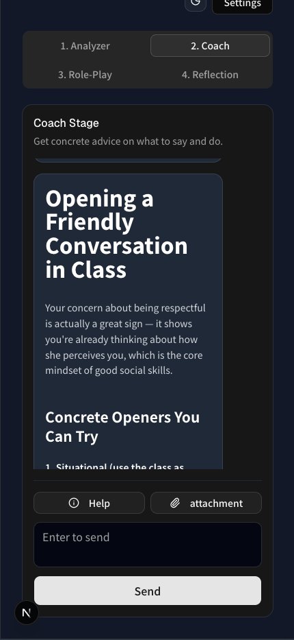
</p>

**Role-Play** — the AI stays in character as the other person so you can rehearse the real back-and-forth. <sub>(click any turn to enlarge)</sub>

<table>
  <tr>
    <td align="center"><a href="./public/images/role-play-1.png">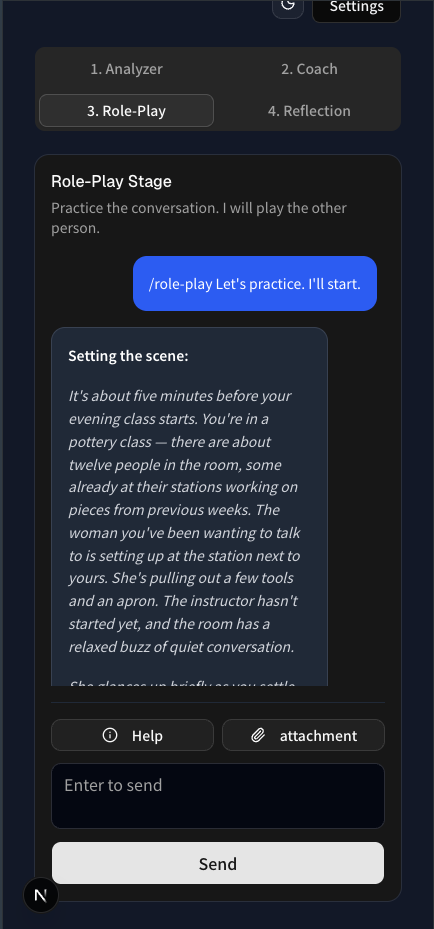</a></td>
    <td align="center"><a href="./public/images/role-play-2.png">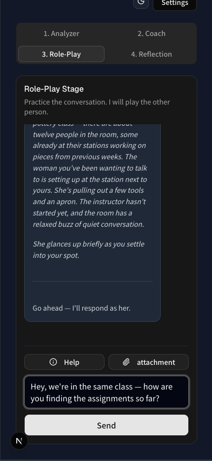</a></td>
    <td align="center"><a href="./public/images/role-play-3.png">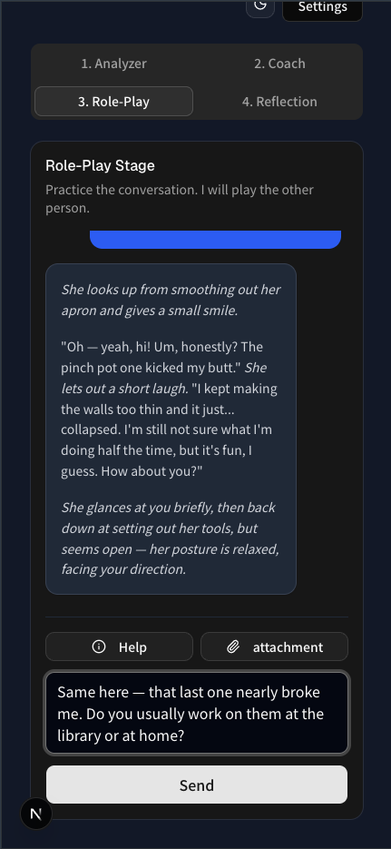</a></td>
    <td align="center"><a href="./public/images/role-play-4.png">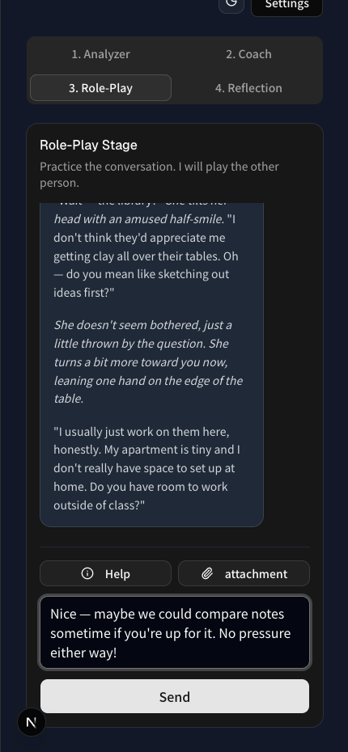</a></td>
    <td align="center"><a href="./public/images/role-play-5.png">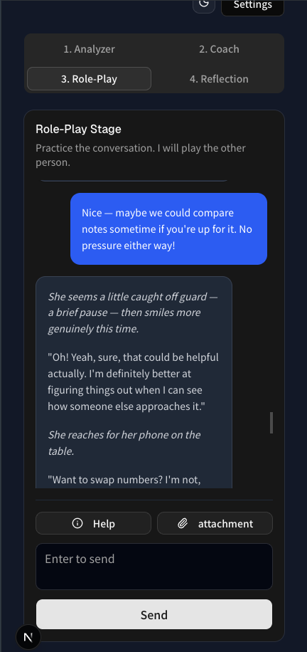</a></td>
  </tr>
  <tr>
    <td align="center"><strong>The scene</strong></td>
    <td align="center"><strong>Your opener</strong></td>
    <td align="center"><strong>She responds</strong></td>
    <td align="center"><strong>Keep it going</strong></td>
    <td align="center"><strong>Low-pressure invite</strong></td>
  </tr>
</table>

**Reflect** — a structured, per-dimension rubric evaluation of how you did.

<p align="center">
  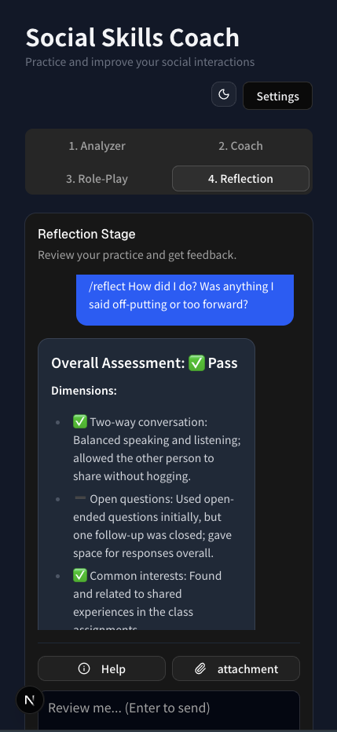
</p>

---

## 🏗️ Architecture

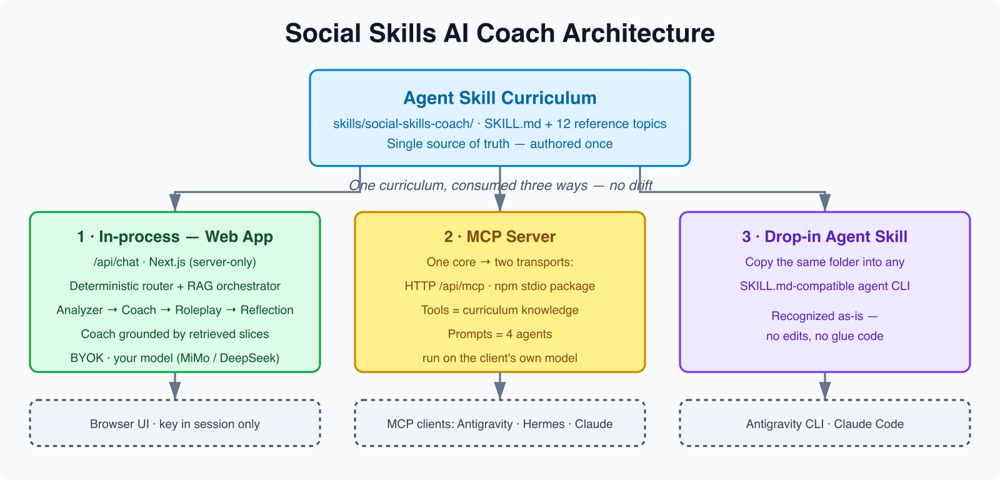

**Key idea:** the curriculum is authored once as an **Agent Skill** and consumed three ways — internally by the coaching agents (in-process, for speed), externally by any MCP client over the **Model Context Protocol** (for reuse and interoperability), and as a drop-in skill in any `SKILL.md`-compatible agent CLI (Antigravity CLI, Claude Code). One source of truth, no drift.

### Course concepts demonstrated

| Concept                        | Where        | How it is demonstrated                                                                                                                                         |
| :----------------------------- | :----------- | :------------------------------------------------------------------------------------------------------------------------------------------------------------- |
| **Agent / Multi-agent system** | Code         | Four specialized agents in a staged pipeline with deterministic stage routing, plus an LLM orchestrator that does knowledge routing (RAG) to ground the Coach. |
| **MCP Server**                 | Code         | `/api/mcp` exposes `list_social_topics` + `get_social_knowledge` (tools) and the four agents (prompts) over MCP for any external client.                       |
| **Agent Skills**               | Code         | `skills/social-skills-coach/` packages the curriculum as a loadable Skill — the single source of truth, recognized as-is by Antigravity CLI / Claude Code when dropped into their skills folder.                                      |
| **Security features**          | Code         | BYOK (your API key stays in the browser session, never stored server-side) + zod validation of every request at the API trust boundary.                        |
| **Deployability**              | Docs / Video | Deployed on Vercel; reproduce steps below.                                                                                                                     |
| **Antigravity**                | Video        | Built with the Antigravity IDE + CLI; shown in the submission video.                                                                                           |

---

## ✨ Features

- **4-stage coaching loop** — Analyzer → Coach → Role-Play → Reflection.
- **Curriculum-grounded advice** — the Coach answers only from curriculum slices retrieved for _your_ situation (RAG), not generic tips.
- **Agent Skill curriculum** — social-skills knowledge authored once as a reusable Skill, the single source of truth; drop it into any agent CLI's skills folder (`.agents/skills`, `.claude/skills`) and it's recognized automatically.
- **MCP server (bring your own model)** — the four agents are exposed as MCP prompts + knowledge tools, so any MCP client can run the whole coach with its own model. Shipped as an npm stdio package, [`social-skills-coach-mcp`](https://www.npmjs.com/package/social-skills-coach-mcp).
- **Multi-model** — switch between Xiaomi MiMo and DeepSeek; automatic failover when the demo key expires.
- **Attachments** — upload images and text files (`.md`, `.txt`, `.csv`) for the AI to analyze.
- **Mobile-first** — designed to reach for in the moment: with a connection and the demo page, the coach is in your pocket anytime. It has been tested on Pixel + Chrome / iPhone + Safari (market share 90+%) and still works smoothly even on older phones from four years ago.
- **Dark / light themes** — reduces eye strain, important for light sensitivity.

---

## 🔒 Security

Enforced at every trust boundary — the browser, the API, and the MCP server:

<p align="center">
  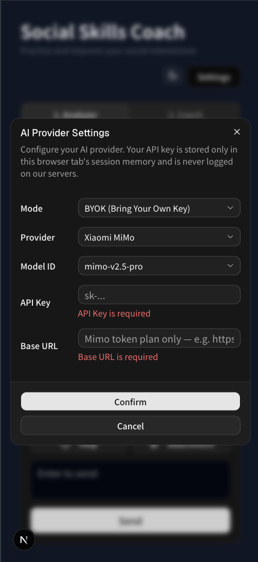
</p>

- **BYOK, never persisted.** Your API key is sent per request via the `Authorization: Bearer` header and used only in memory — never logged, never written to a database.
- **Session-only storage.** The browser keeps the key + chat history in `sessionStorage` (not `localStorage`), so they're wiped when the tab closes.
- **zod validation at the trust boundary.** Every `/api/chat` and MCP request is parsed with zod; malformed JSON or shapes are rejected (`400`) before reaching any model, and missing keys are gated (`401`).
- **No internal leakage.** Errors are logged server-side only; clients get generic messages (`Internal Server Error`), never stack traces or secrets.
- **Stateless by design.** No database, no server-side user data.
- **SonarQube Code Quality Verified.** All Ratings: A (Security, Reliability, Maintainability).

---

## 🧩 Use it as a portable Agent Skill (drop-in, no code)

The curriculum is a standard **`SKILL.md` Agent Skill**, so it isn't locked to this app. Drop the `social-skills-coach` folder into any SKILL.md-compatible agent runtime and it's recognized automatically — same folder, no edits, no glue code.

```bash
cp -r skills/social-skills-coach .agents/skills/    # Antigravity CLI (workspace)
cp -r skills/social-skills-coach ~/.claude/skills/  # shared with Claude
```

| Runtime                     | Picked up from                                                  |
| :-------------------------- | :------------------------------------------------------------- |
| Antigravity CLI — workspace | `.agents/skills/social-skills-coach/SKILL.md`                  |
| Antigravity CLI — global    | `~/.gemini/antigravity-cli/skills/social-skills-coach/SKILL.md` |
| Claude Code / shared        | `~/.claude/skills/social-skills-coach/SKILL.md`                |

<table>
  <tr>
    <td align="center" width="50%"><a href="./public/images/skills-in-agy-cli.png">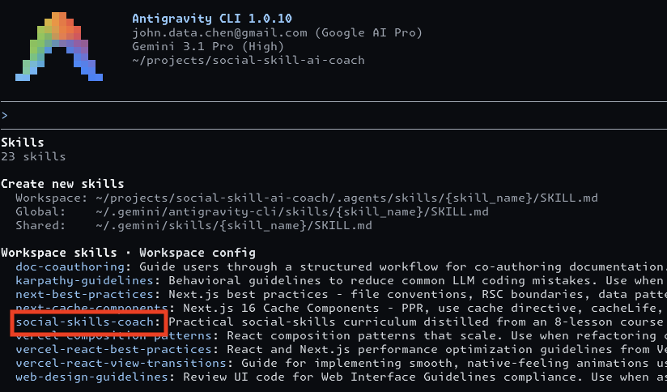</a></td>
    <td align="center" width="50%"><a href="./public/images/skills-in-claude-app.png">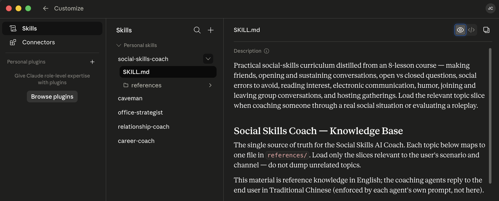</a></td>
  </tr>
  <tr>
    <td align="center"><strong>Antigravity CLI</strong> — dropped into the workspace skills folder</td>
    <td align="center"><strong>Claude app</strong> — imported under Personal skills</td>
  </tr>
</table>

<p align="center"><em>The same SKILL.md, recognized across runtimes — no wiring, no edits.</em></p>

The second way the one curriculum is consumed (alongside in-process and MCP): authored once, reused anywhere.

---

## 🧰 Use it as an MCP server (bring your own model)

The whole coaching capability is **also a standalone MCP server** — so it runs in _any_ MCP client, on _any_ model you choose. The four sub-agents are exposed as MCP **prompts**: they execute on the _connecting client's_ model, so the server holds no API key and runs no inference itself. Plug in a model more capable than the demo's MiMo/DeepSeek — or whatever your local already runs.

**One server, many clients, many models.** Here it is live in two independent MCP clients — same package, no edits:

<table>
  <tr>
    <td align="center" width="50%"><a href="./public/images/mcp-in-agy-cli.png">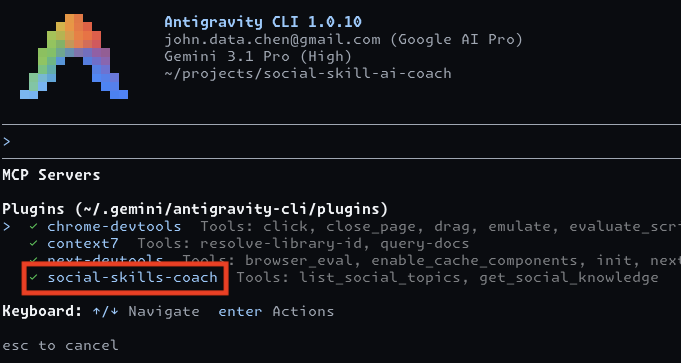</a></td>
    <td align="center" width="50%"><a href="./public/images/mcp-in-hermes-agent.png">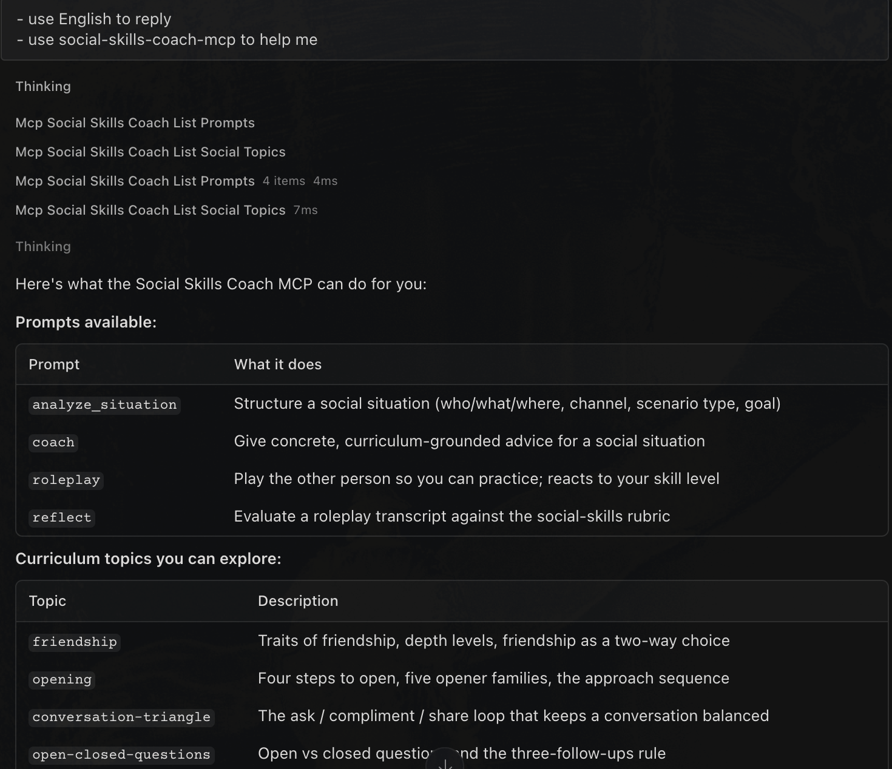</a></td>
  </tr>
  <tr>
    <td align="center"><strong>Antigravity CLI</strong> — registered as an MCP server (runs on Gemini)</td>
    <td align="center"><strong><a href="https://github.com/NousResearch/hermes-agent">Hermes Agent</a></strong> (Nous Research) — same server, any of 200+ models</td>
  </tr>
</table>

<p align="center"><em>One MCP server, any client, any model — no edits, no per-client glue.</em></p>

**What it exposes:**

- **Prompts** (run on _your_ model): `analyze_situation` · `coach` · `roleplay` · `reflect`
- **Tools** (knowledge grounding): `list_social_topics` · `get_social_knowledge({ topics })`

### Option 1 — npm package over stdio (recommended for local clients)

Published as [`social-skills-coach-mcp`](https://www.npmjs.com/package/social-skills-coach-mcp). Add it to your client's `mcp.json` (Claude Desktop, Cursor, Antigravity, …):

```json
{
  "mcpServers": {
    "social-skills-coach": { "command": "npx", "args": ["-y", "social-skills-coach-mcp"] }
  }
}
```

Or inspect it interactively:

```bash
npx @modelcontextprotocol/inspector npx -y social-skills-coach-mcp
```

### Option 2 — hosted HTTP (the deployed app)

The same capability is served at `POST <your-host>/api/mcp` (Streamable HTTP transport). Quick smoke test against a running server:

```bash
curl -s -X POST http://localhost:3000/api/mcp \
  -H "Content-Type: application/json" \
  -H "Accept: application/json, text/event-stream" \
  -d '{"jsonrpc":"2.0","id":1,"method":"tools/call","params":{"name":"get_social_knowledge","arguments":{"topics":["opening"]}}}'
```

Both forms share one core (`registerSocialSkillsMcp`) and one curriculum source (the Agent Skill), so they never drift.

---

## 📂 Repository structure

```text
├── skills/social-skills-coach/  # Agent Skill: the curriculum (runtime product knowledge, single source of truth)
├── .agents/skills/              # Antigravity agent skills (development-time AI assistants like karpathy/vercel)
├── packages/
│   └── social-skills-coach-mcp/ # Publishable npm stdio MCP server (prompts + tools)
├── .github/workflows/           # CI/CD (testing & Vercel deployment)
├── __tests__/
│   ├── e2e/                      # Playwright end-to-end tests
│   └── units/                    # Vitest unit tests
├── src/
│   ├── app/
│   │   ├── api/
│   │   │   ├── chat/route.ts         # Coaching chat: routing + RAG grounding + streaming
│   │   │   └── [transport]/route.ts  # MCP server (resolves to /api/mcp)
│   │   ├── layout.tsx
│   │   └── page.tsx                  # Main UI and chat interface
│   ├── components/                   # React components (ui/ from Base UI / shadcn)
│   └── lib/
│       ├── agents/                   # Stage agents + knowledge adapter
│       ├── knowledge/                # Loader that reads the Agent Skill slices
│       ├── mcp/server-setup.ts       # Shared MCP registration (tools + agent prompts)
│       ├── orchestrator.ts           # LLM topic selection + grounding (server-only)
│       ├── router.ts                 # Deterministic stage routing (client-safe)
│       ├── ai.ts                     # Provider init (MiMo / DeepSeek)
│       └── store.ts                  # Zustand state (history, config)
├── public/
│   └── images/                  # Architecture PNG, cover, screenshots (README / Media Gallery)
├── next.config.mjs              # outputFileTracingIncludes ships the skill md to Vercel
└── env.example                  # Template for environment variables
```

---

## 💻 Local development & testing

### 1. Prerequisites

- [Node.js](https://nodejs.org/) (v24 or latest LTS)
- [pnpm](https://pnpm.io/installation) (latest)

### 2. Install

```bash
pnpm install
```

### 3. Environment variables (optional — only for "Demo" mode)

The app defaults to **BYOK**: paste your own API key in the Settings dialog, no server config needed. To use the built-in "Demo (Server Key)" mode instead:

```bash
cp env.example .env
# then fill in MIMO_API_KEY + MIMO_API_BASE_URL and/or DEEPSEEK_API_KEY
```

### 4. Run

```bash
pnpm dev          # start the dev server at http://localhost:3000
pnpm test         # unit tests (Vitest)
pnpm test:e2e     # end-to-end tests (Playwright)
pnpm build        # production build (typecheck + Next build)
```

---

<a id="byok"></a>

## 🔑 Get an API key (BYOK)

This app is **BYOK** (bring your own key): you supply one API key, used only in your browser session — never stored server-side. Pick **one** provider:

| Provider        | Get a key                                                                  | Cost            | Env vars                                                                                                |
| :-------------- | :------------------------------------------------------------------------- | :-------------- | :----------------------------------------------------------------------------------------------------- |
| **Xiaomi MiMo** | Subscribe a [MiMo token plan](https://platform.xiaomimimo.com/token-plan)  | from **$6/mo**  | `MIMO_API_KEY` + `MIMO_API_BASE_URL` (match your plan, e.g. `https://token-plan-cn.xiaomimimo.com/v1`) |
| **DeepSeek**    | Top up at [DeepSeek](https://platform.deepseek.com/)                       | from **$2**     | `DEEPSEEK_API_KEY`                                                                                      |

Use it one of two ways:

- **In the app (BYOK):** open **Settings** and paste the key — it lives only in this tab's session, nothing to configure server-side.
- **Server / Demo mode:** put the key(s) in environment variables (`env.example`); see **Deployment (Vercel)** below.

---

## 🚀 Deployment (Vercel)

This repo is a public template — deploy your own instance in one click. It runs immediately in **BYOK** mode (open **Settings**, paste your own MiMo or DeepSeek key — see [Get an API key (BYOK)](#byok)); no login, no paywall.

[](https://vercel.com/new/clone?repository-url=https://github.com/john-data-chen/social-skill-ai-coach)

### 1. Deploy

Click **Deploy with Vercel** (a free Vercel account is required; sign in with GitHub in one click). Vercel clones the repo into your account, then asks you to create the Git repository — keep the defaults and click **Create**.

<p align="center">
  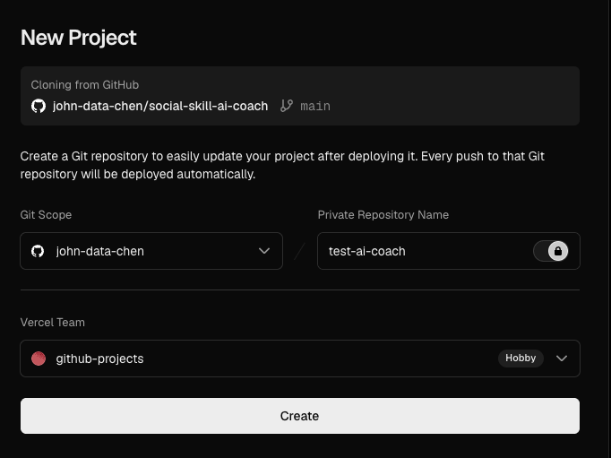
</p>

When the build finishes, open the deployment URL. It already works in BYOK mode: open **Settings**, paste your key, and start.

### 2. Optional — enable Demo (Server Key) mode

Want the deployed site to work without each visitor pasting a key? Add a server key. In your project, open **Environment Variables**:

<p align="center">
  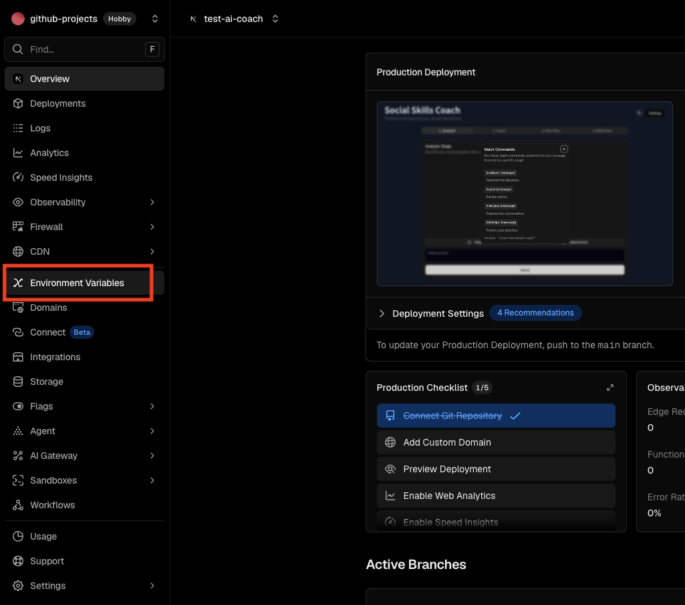
</p>

Click **Add Environment Variable**:

<p align="center">
  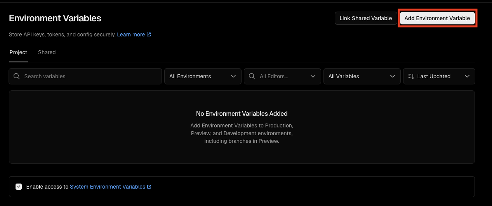
</p>

Add the keys from the [BYOK table](#byok) (one of MiMo / DeepSeek), turn on **Sensitive**, and **Save** — then redeploy.

<p align="center">
  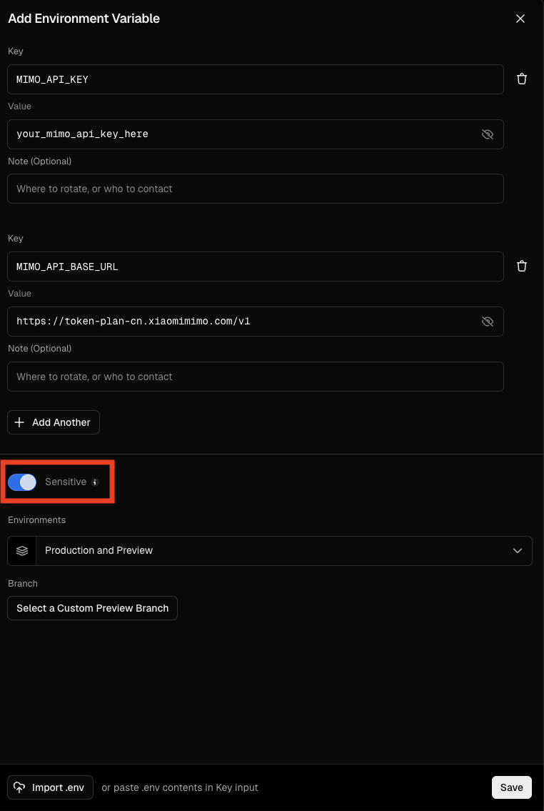
</p>

> **Never commit API keys or passwords.** Use environment variables.

---

## 🛠️ Tech stack

Next.js (App Router) · React · TypeScript (strict) · TailwindCSS · Vercel AI SDK · Zustand · Vitest + Playwright · pnpm · deployed on Vercel.

---

## 📋 Roadmap

- Support more modles and providers: Anthropic, OpenAI, Google Gemini...etc

---

## ⚠️ Disclaimer

This project is a conceptual product (minimum viable product) developed for the [Kaggle AI Agents: Intensive Vibe Coding Capstone Project](https://www.kaggle.com/competitions/vibecoding-agents-capstone-project). The participating track is **Agents for Good**, and it is for review and research by interested parties only. All functions (including but not limited to the Demo, AI agents, Skill, and MCP) **cannot replace professionally trained and licensed psychologists or therapists**, and cannot provide any medical treatment or consultation.

The demo website uses the [Xiaomi MiMo token plan](https://platform.xiaomimimo.com/token-plan) to operate with a minimum monthly token plan. It can be used directly. **The monthly token plan will be expired after Kaggle review, and no DeepSeek key has been prepared.**

Please always remember: **you are talking to an AI.** Avoid mentioning personal information such as your real name, phone number, or address; use a pseudonym if needed. AI can make mistakes and hallucinate — all suggestions are for reference only.

---

## 📄 License

[MIT](https://opensource.org/licenses/MIT)
